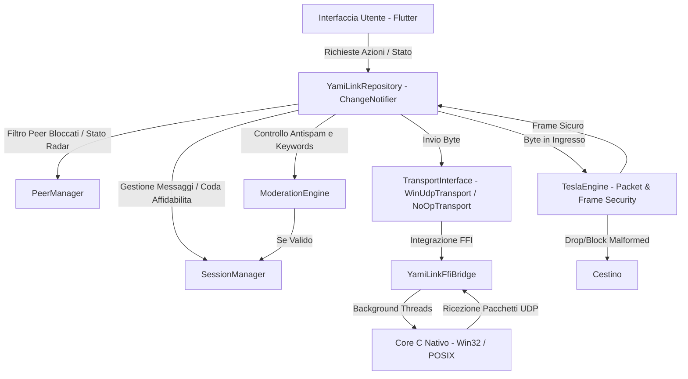
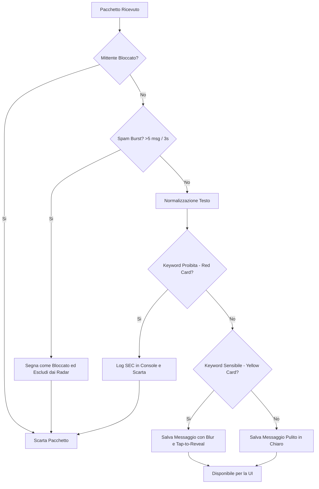

# YamiLink

YamiLink e' un'applicazione di comunicazione locale e decentralizzata progettata per operare offline, sfruttando la prossimita' fisica delle stazioni peer. Pensata per scenari temporanei o a infrastruttura assente (come conferenze, campus universitari, LAN party, sistemi di transito o contesti di emergenza), YamiLink implementa un livello sociale effimero che si attiva esclusivamente quando i partecipanti sono fisicamente vicini, per poi svanire senza lasciare tracce persistenti una volta che le stazioni si allontanano.

---

## Posizionamento del Prodotto

* **Definizione:** Un livello sociale locale che esiste unicamente laddove si trova l'utente.
* **Promessa Fondamentale:** Identificare i nodi limitrofi, stabilire canali di comunicazione locale, non memorizzare alcuna informazione permanente.
* **Tono del Progetto:** Minimale, orientato alla sicurezza e alla privacy, improntato ad uno stile cyberpunk pulito e funzionale.
* **Ambito Tecnico:** Scoperta dei nodi a 1-hop, profili effimeri, comunicazioni broadast locali, abbinamento sicuro delle chiavi crittografiche dei peer (ECDH) e diagnostica di telemetria a basso livello.

---

## Funzionalità Principali

* **Routing Mesh Epidemico (Store-and-Forward):** I messaggi broadcast vengono ritrasmessi dai nodi della rete adiacenti incrementando il contatore degli hop. Il sistema implementa una cache di deduplica `_processedMessageKeys` nel `SessionManager` che scarta i messaggi già visti per prevenire tempeste di broadcast (loop infiniti).
* **Accoppiamento Crittografico (Diffie-Hellman):** I nodi possono avviare uno scambio effimero di chiavi X25519 (ECDH) tramite pacchetti HELLO. Questo genera un segreto condiviso utilizzato per crittografare i Direct Message con AES-GCM.

---

## Architettura di Sistema

L'architettura dell'applicazione segue una chiara separazione dei compiti tra l'interfaccia utente in Flutter, lo strato di controller Dart e il core nativo in linguaggio C per la gestione dei socket.

Il seguente diagramma illustra il flusso dei dati e l'interazione tra i componenti:



---

## Struttura del Protocollo Frame

Le comunicazioni di rete utilizzano un protocollo a livello applicativo basato su stringhe ASCII delimitate. Questo formato garantisce la compatibilita' cross-platform evitando problemi di endianness o padding delle strutture binarie C:

```
VERSIONE:TIPO:SENDER_ID:RECIPIENT_ID:SESSION_ID:MESSAGE_ID:TIMESTAMP:FLAGS:HOP_COUNT:PAYLOAD_TYPE:BASE64_PAYLOAD
```

### Componenti del Frame

| Campo | Descrizione |
| --- | --- |
| VERSIONE | Identificatore del protocollo applicativo (es. YML1). |
| TIPO | Tipologia di pacchetto (RM = Room Message, DM = Direct Message, ACK = Acknowledgment, BC = Beacon). |
| SENDER_ID | Hash esadecimale a 16 caratteri che identifica univocamente la stazione trasmittente. |
| RECIPIENT_ID | Hash esadecimale del destinatario per i DM, oppure "*" per i messaggi broadcast. |
| SESSION_ID | Identificatore casuale della sessione temporanea della stazione trasmittente. |
| MESSAGE_ID | Contatore sequenziale dei messaggi per la rilevazione dei duplicati e gestione ACK. |
| TIMESTAMP | Tempo Unix Epoch in millisecondi. |
| FLAGS | Maschera di bit per opzioni speciali (es. inoltro abilitato). |
| HOP_COUNT | Contatore dei salti per il routing mesh (incrementato ad ogni relay). |
| PAYLOAD_TYPE | Formato del corpo del pacchetto (es. text/plain o crypto/aes). |
| BASE64_PAYLOAD | Corpo del messaggio codificato in Base64 (contenente il ciphertext se criptato). |

---

## Sistema di Moderazione e Antispam Locale

La moderazione dei contenuti in YamiLink e' decentralizzata ed in-memory. Non dipende da server centrali e opera in tempo reale su ogni singolo client.

Il flusso di elaborazione dei pacchetti ricevuti segue questo schema decisionale:



### Dettaglio dei Sotto-Sistemi

* **Rilevazione dello Spam (Burst Rate-Limiting):** Per ogni peer viene mantenuta una finestra scorrevole temporale. Se un peer trasmette piu' di 5 messaggi entro un intervallo di 3 secondi, viene automaticamente identificato come spammer. Il suo stato di confidenza passa a `blocked`, tutti i suoi pacchetti futuri vengono rifiutati all'ingresso ed il peer svanisce dalla lista radar.
* **Normalizzazione del Testo:** Al fine di prevenire l'aggiramento dei filtri tramite l'uso di spazi, punteggiatura o simboli speciali, la stringa viene normalizzata convertendola in minuscolo e rimuovendo qualsiasi carattere non alfanumerico prima del controllo (es. `s.p.a.m_m_i_n.g` viene normalizzato in `spamming`).
* **Regole a Semaforo:**
  * **Rosso (Disallowed):** Parole chiave associate a violazioni gravi dei termini d'uso (es. minacce o doxxing). I messaggi vengono bloccati immediatamente alla ricezione e scartati. L'evento viene registrato nella console di diagnostica con tag `SEC:`.
  * **Giallo (Sensitive):** Termini sensibili o volgari. Il messaggio viene accettato, ma visualizzato nella chat con un filtro grafico offuscato (sfocatura). Il destinatario puo' toccare la bolla per rimuovere la sfocatura (meccanismo Tap-to-Reveal).

---

## Sicurezza e Hardening: Il Sottosistema Tesla

Per proteggere l'applicazione da attacchi Denial of Service (DoS) locali, tampering, spoofing e replay, YamiLink integra **Tesla**, un firewall applicativo posizionato tra il layer FFI C-Native e il parsing Dart.

### Funzioni di Difesa (Tesla Engine)

1. **Protezione FFI (Boundary Safety):** I payload provenienti dalla FFI sono strettamente limitati a 2048 byte per scongiurare buffer overflow logici e memory exhaustion. Inoltre, `TeslaPacketValidator` cestina istantaneamente pacchetti senza la signature `YML1:` evitando costose conversioni UTF-8 su spazzatura (UDP flood prevention).
2. **Prevenzione Peer Spoofing:** `TeslaSpoofGuard` memorizza una tabella hash di routing (`senderId` logico -> `senderHash` FFI nativo). Se un attaccante tenta di forgiare pacchetti con l'ID di un altro nodo dalla propria rete, Tesla rileva l'incoerenza dell'identita' e scarta il pacchetto silenziosamente.
3. **Difesa Anti-Replay:** `TeslaReplayGuard` implementa una cache con *sliding window* di 60 secondi che ispeziona in tandem `(senderId, messageId)` e timestamp. I frame replicati, incollati sulla rete o catturati nel passato, vengono cestinati, rendendo immuni le chat a flood da replay.

### TamperGuard (Environment & Anti-Reverse Engineering)

L'app implementa controlli custom leggeri per il rilevamento di ambienti modificati o ostili.
Su build **Release**, `TamperGuard` analizza:
* La presenza anomala di debug flag o Virtual Machine observatory injection in produzione.
* Variabili d'ambiente comuni usate da framework di strumentazione (es. Frida, Xposed).
* (Su Android) Binari classici indicanti root (es. magisk, su) usando euristiche basate su file system standard.

---

## Affidabilita' delle Connessioni P2P (Strato di Trasporto)

Dato che il protocollo UDP non garantisce la consegna o l'ordinamento dei pacchetti, YamiLink implementa un sistema di conferma a livello applicativo:

1. **Trasmissione e Timeout:** Quando viene inviato un pacchetto diretto (DM), questo viene inserito in una coda temporanea e marcato come `sending`. Viene contemporaneamente impostato un timer a 400ms.
2. **Ricezione ACK:** Il destinatario, alla ricezione del pacchetto di tipo `directMsg`, risponde immediatamente con un frame di tipo `ack`.
3. **Retransmit Loop:** Se il mittente riceve l'ACK entro 400ms, cancella il timer e aggiorna lo stato in `delivered`. In caso contrario, esegue un tentativo di reinvio del pacchetto, fino a un massimo di 3 tentativi. Raggiunto il limite senza riscontro, il messaggio assume lo stato `failed`.
4. **Deduplicazione:** Per evitare di elaborare piu' volte messaggi duplicati a causa di ACK persi, ogni stazione mantiene una lista degli ultimi 50 ID messaggio elaborati per ciascun peer. I messaggi duplicati vengono scartati ma l'ACK viene inviato nuovamente al mittente.

---

## Struttura delle Directory

```
yamilink/
├── lib/
│   ├── core/
│   │   ├── moderation/
│   │   │   └── moderation_engine.dart   # Motore di normalizzazione e analisi semantica
│   │   ├── protocol/
│   │   │   └── frame.dart               # Serializzazione/Deserializzazione protocollo applicativo
│   │   ├── state/
│   │   │   ├── peer_manager.dart        # Gestione liveness del radar, blocchi ed antispam
│   │   │   └── session_manager.dart     # Storia dei messaggi, code ACK e rilevazione duplicati
│   │   └── transport/
│   │       ├── noop_transport.dart      # Adattatore strutturale (fallback) per piattaforme sprovviste di FFI
│   │       ├── transport_interface.dart # Interfacce astratte per la trasmissione di rete
│   │       └── win_udp_transport.dart   # Implementazione Winsock per Windows
│   ├── repository/
│   │   └── yamilink_repository.dart     # Controller centralizzato ChangeNotifier
│   ├── chats_screen.dart                # Lista delle conversazioni private attive
│   ├── diagnostics_screen.dart          # Telemetria di sistema e log di sicurezza SEC
│   ├── direct_chat_screen.dart          # Chat diretta crittografata con gestione blocchi e blur
│   ├── entry_screen.dart                # Configurazione del profilo temporaneo
│   ├── main.dart                        # Struttura di navigazione e gestione del badge notifiche
│   ├── nearby_screen.dart               # Radar di prossimita' spaziale e foglio di accoppiamento
│   ├── room_screen.dart                 # Chat di gruppo broadcast locale
│   ├── theme.dart                       # Sistema di design cyberpunk, sfumature neon e glassmorfismo
│   └── widgets/
│       └── avatar.dart                  # Generatore vettoriale di avatar basato su seed
├── test/
│   ├── moderation_test.dart             # Test unitari per moderazione, spam rate-limit e normalizzazione
│   ├── protocol_test.dart               # Test di conformita' della serializzazione dei frame
│   └── reliability_test.dart            # Test delle code di re-invio, deduplicazione e logica unread
└── windows/
    └── src/
        └── yamilink_core.c              # Logica UDP nativa multithread per la piattaforma Windows
```

---

## Istruzioni per l'Avvio

### Prerequisiti

* SDK Flutter (compatibile con Dart 3.x)
* Compilatore C++ (MSVC su Windows per il build nativo)

### Configurazione

1. Clonare il repository nella cartella di lavoro locale.
2. Scaricare le dipendenze del framework:
   ```bash
   flutter pub get
   ```
3. Eseguire l'analisi statica per verificare l'assenza di warning di compilazione:
   ```bash
   flutter analyze
   ```
4. Avviare i test unitari integrati:
   ```bash
   flutter test
   ```
5. Eseguire l'applicazione in modalita' debug:
   ```bash
   flutter run -d windows
   ```

---

## Sviluppi Futuri

* **Supporto Cross-Platform Nativo:** Sviluppo dei bridge nativi per iOS (Multipeer Connectivity) ed Android (Nearby Connections / Wi-Fi Direct Sockets).
