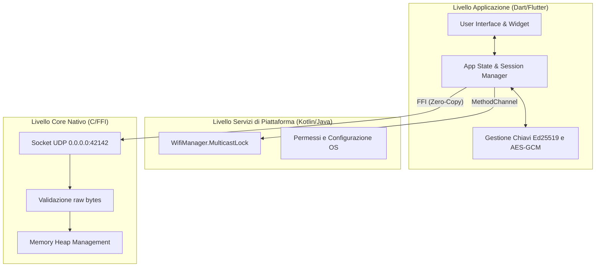
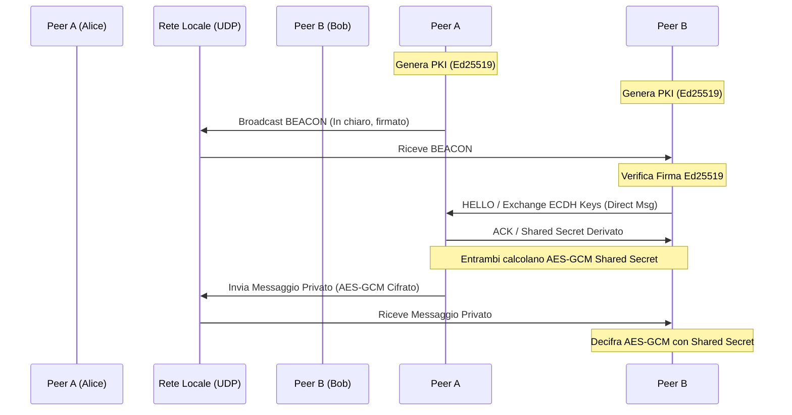

# YamiLink

YamiLink è un'applicazione di comunicazione locale e decentralizzata progettata per operare offline, sfruttando la prossimità fisica delle stazioni peer. Pensata per scenari temporanei o a infrastruttura assente (come conferenze, campus universitari, LAN party, sistemi di transito o contesti di emergenza), YamiLink implementa un livello sociale effimero che si attiva esclusivamente quando i partecipanti sono fisicamente vicini, per poi svanire senza lasciare tracce persistenti una volta che le stazioni si allontanano.

---

## Architettura di Rete e di Sistema

YamiLink è costruito su un'architettura ibrida a tre strati (Tri-Layer) per garantire prestazioni massime su ogni piattaforma.



### Posizionamento del Prodotto

* **Definizione:** Un livello sociale locale che esiste unicamente laddove si trova l'utente.
* **Promessa Fondamentale:** Identificare i nodi limitrofi, stabilire canali di comunicazione locale, non memorizzare alcuna informazione permanente.
* **Tono del Progetto:** Minimale, orientato alla sicurezza e alla privacy, improntato ad uno stile cyberpunk pulito e funzionale.
* **Ambito Tecnico:** Scoperta dei nodi a n-hop (mesh epidemico), profili effimeri PKI, comunicazioni broadcast locali, abbinamento sicuro delle chiavi crittografiche dei peer (ECDH) e diagnostica di telemetria a basso livello.
* **Target Tecnologico:** Core nativo in C interfacciato tramite FFI a logica Dart. Implementazione nativa Kotlin per MulticastLock su Android.

---

## Flusso di Comunicazione e Sicurezza

La vulnerabilità classica delle reti ad-hoc (Spoofing dell'identità) è mitigata tramite una **Public Key Infrastructure (PKI) effimera**. 

Ecco come i nodi si scoprono e stabiliscono un canale sicuro:



### 1. Identità Crittografica
Alla creazione del profilo, ogni nodo genera una coppia di chiavi asimmetriche Ed25519. L'identificativo del nodo (`senderId`) sulla rete corrisponde all'hash della chiave pubblica. Ogni pacchetto inviato sulla rete include una firma crittografica generata con la chiave privata. 

### 2. Accoppiamento Crittografico Reale (Trust Pairing - V2)
I nodi avviano uno scambio reale di chiavi crittografiche (scambio effimero X25519). Il segreto condiviso (Shared Secret) viene impiegato per stabilire canali sicuri End-to-End cifrando i payload privati in **AES-GCM a 256 bit**, rendendoli totalmente inleggibili ai relay intermedi della rete mesh.

---

## Mesh Routing Epidemico (Store-and-Forward)

I messaggi broadcast e i Direct Message vengono ritrasmessi dai nodi della rete adiacenti incrementando il contatore degli hop (`hopCount`). 

```mermaid
graph LR
    A[Nodo A (Mittente)] -->|Hop 1| B(Nodo B - Relay)
    A -->|Hop 1| C(Nodo C - Relay)
    B -->|Hop 2| D[Nodo D (Destinatario Lontano)]
    C -->|Hop 2| D
    D -->|Scarta Duplicato| D
```

Il sistema implementa una cache di deduplica `_processedMessageKeys` nel `SessionManager` che scarta i messaggi già ritrasmessi o processati per prevenire loop infiniti o broadcast storm a livello di Mesh. 

---

## Struttura del Protocollo Frame (YML2 Binary - V2.0)

Le comunicazioni di rete utilizzano il protocollo binario `YML2` ad altissime prestazioni per azzerare il parsing di stringhe. La struttura a campi binari previene manipolazioni logiche e garantisce compatibilità FFI nativa tramite *Zero-Copy passing*.

Un Frame YML2 consiste in un **Header Fisso di 178 byte**, un **Payload Dinamico** e una **Firma di 64 byte**:

| Campo | Offset (Byte) | Dimensione | Tipo | Descrizione |
| --- | --- | --- | --- | --- |
| VERSIONE | 0 | 1 | uint8_t | Versione del protocollo (attualmente `2`). |
| TIPO | 1 | 1 | uint8_t | Tipologia (`0`=Beacon, `1`=Room, `2`=Direct, `3`=Ack, `4`=Hello, `5`=HelloAck). |
| FLAGS | 2 | 1 | uint8_t | Maschera di bit. Bit 0: Cifrato AES-GCM. |
| HOP_COUNT | 3 | 1 | uint8_t | Contatore dei salti per il routing mesh. (Non firmato). |
| TIMESTAMP | 4 | 8 | int64_t | Tempo Unix Epoch in ms (Anti-replay window). |
| MESSAGE_ID | 12 | 4 | uint32_t | Contatore messaggi per deduplica e ACK. |
| SESSION_ID | 16 | 32 | char[32] | Sessione effimera in stringa fissa. |
| SENDER_ID | 48 | 64 | char[64] | Chiave pubblica Ed25519 mittente (hex fissa). |
| RECIPIENT_ID | 112 | 64 | char[64] | Chiave destinatario o asterisco (`*`) padding. |
| PAYLOAD_LEN | 176 | 2 | uint16_t | Lunghezza del payload dati (Max 2800 bytes). |
| PAYLOAD_BODY | 178 | [PAYLOAD_LEN] | uint8_t[] | Dati in chiaro o crittografati in AES-GCM. |
| SIGNATURE | 178+LEN | 64 | uint8_t[64] | Firma Ed25519 dei primi 178+LEN byte (meno hop count). |

---

## Sicurezza e Hardening: Il Sottosistema Tesla

Per proteggere l'applicazione da attacchi Denial of Service (DoS), tampering e replay, YamiLink integra **TeslaEngine**, un firewall applicativo C-Native/Dart che ispeziona i pacchetti.

1. **Protezione Boundary FFI (PacketValidator):** I byte raw allocati in C vengono validati in dimensione e verificati contro versioni non consentite (solo version 2) prima che raggiungano il motore Dart.
2. **Prevenzione Peer Spoofing (SpoofGuard):** Elabora la `SIGNATURE` Ed25519. Se la firma non corrisponde al frame, la drop è istantanea.
3. **Difesa Anti-Replay (ReplayGuard):** Implementa una *sliding window* rigorosa di 60 secondi che ispeziona `(senderId, messageId)` e timestamp limitando lo *spam duplicate*.

---

## Affidabilità delle Connessioni (Strato di Trasporto)

Dato che la rete sottostante (UDP) non garantisce la consegna, YamiLink implementa un sistema logico a Livello Applicativo per garantire certezza dell'invio:
1. **Trasmissione e Timeout:** Un DM viene marcato come `sending` nella UI. Un timer interno controlla la ricezione di una risposta.
2. **ACK Automatici:** Il destinatario di un DM valido emette automaticamente un Frame `ACK`.

---

## Struttura delle Directory

```
yamilink/
├── lib/
│   ├── core/
│   │   ├── moderation/      # Motore semantico di local-filtering e antispam
│   │   ├── protocol/        # Formato binario YML2 (Serializzazione Frame)
│   │   ├── security/        # Motore Tesla (SpoofGuard, ReplayGuard)
│   │   ├── state/           # Mantenimento stato e profili peer
│   │   └── transport/       # Bridge verso strato C e Kotlin (MulticastManager)
│   ├── repository/          # YamiLinkRepository - Controller orchestratore E2EE
│   ├── ui/                  # Componentistica grafica e schermate applicative
│   └── models.dart          # Modelli dati principali
├── native_core/
│   ├── yamilink_core.c      # Logica nativa FFI, UDP e Memory Mapping binario
│   └── yamilink_core.h      # C Struct Header per YML2
├── android/
│   └── app/src/main/kotlin/ # Layer nativo per lock Wifi Multicast
└── test/                    # Suite di penetrazione, stress, e fuzzing binario
```

---

## Istruzioni per lo Sviluppo e l'Esecuzione

### Prerequisiti
* SDK Flutter (Dart 3.x)
* Compilatore C++ / C (MSVC su Windows o NDK per Android)

### Configurazione
1. Clona il repository e scarica le dipendenze:
   ```bash
   git clone <repo-url>
   cd yamilink
   flutter pub get
   ```

2. Esegui la suite di validazione e Fuzzing di sicurezza:
   ```bash
   flutter test test/tesla_security_test.dart
   flutter test test/stress_test.dart
   ```

3. Avvia l'applicazione:
   ```bash
   flutter run -d windows
   flutter run -d android
   ```
