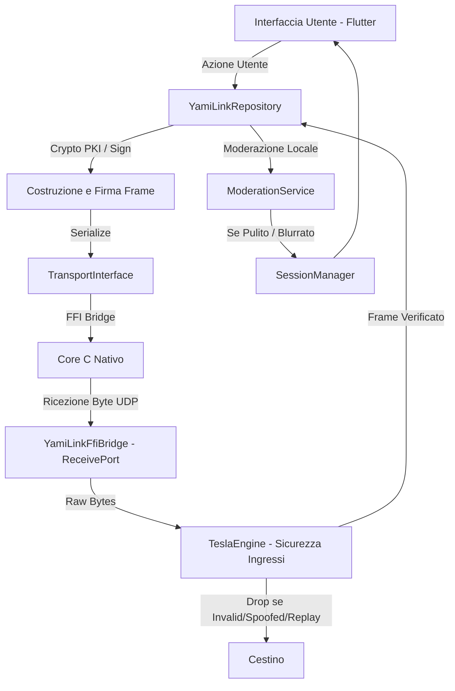

# YamiLink

YamiLink è un'applicazione di comunicazione locale e decentralizzata progettata per operare offline, sfruttando la prossimità fisica delle stazioni peer. Pensata per scenari temporanei o a infrastruttura assente (come conferenze, campus universitari, LAN party, sistemi di transito o contesti di emergenza), YamiLink implementa un livello sociale effimero che si attiva esclusivamente quando i partecipanti sono fisicamente vicini, per poi svanire senza lasciare tracce persistenti una volta che le stazioni si allontanano.

---

## Posizionamento del Prodotto

* **Definizione:** Un livello sociale locale che esiste unicamente laddove si trova l'utente.
* **Promessa Fondamentale:** Identificare i nodi limitrofi, stabilire canali di comunicazione locale, non memorizzare alcuna informazione permanente.
* **Tono del Progetto:** Minimale, orientato alla sicurezza e alla privacy, improntato ad uno stile cyberpunk pulito e funzionale.
* **Ambito Tecnico:** Scoperta dei nodi a n-hop (mesh epidemico), profili effimeri PKI, comunicazioni broadcast locali, abbinamento sicuro delle chiavi crittografiche dei peer (ECDH) e diagnostica di telemetria a basso livello.
* **Target Tecnologico:** Core nativo in C interfacciato tramite FFI a logica Dart, con target principale Windows Desktop e compatibilità nativa preservata per Android.

---

## Funzionalità Principali

### 1. Mesh Routing Epidemico (Store-and-Forward)
I messaggi broadcast (e i Direct Message diretti ad altri nodi) vengono ritrasmessi dai nodi della rete adiacenti incrementando il contatore degli hop (`hopCount`). 
Il sistema implementa una cache di deduplica `_relayedMessageKeys` nel `YamiLinkRepository` che scarta i messaggi già ritrasmessi per prevenire loop infiniti o broadcast storm. I frame mantengono traccia della loro vita nella rete, garantendo che i messaggi possano superare la distanza di singolo hop se i nodi intermedi offrono ritrasmissione.

### 2. Identità Crittografica (Ed25519 PKI)
La vulnerabilità classica delle reti ad-hoc (Spoofing dell'identità First-Come First-Served) è mitigata tramite una **Public Key Infrastructure (PKI) effimera**.
Alla creazione del profilo, ogni nodo genera una coppia di chiavi asimmetriche Ed25519. L'identificativo del nodo (`senderId`) sulla rete corrisponde all'hash della chiave pubblica. Ogni singolo pacchetto (`Frame`) inviato sulla rete include una firma crittografica generata con la chiave privata. I nodi riceventi (tramite il sottosistema Tesla) verificano la firma rispetto all'ID dichiarato prima di elaborare qualsiasi dato.

### 3. Accoppiamento Crittografico (Trust Pairing ECDH - V2)
I nodi possono avviare uno scambio effimero di chiavi tramite la curva X25519 (ECDH) inviando pacchetti di tipo `HELLO`. Al completamento dello scambio, i due nodi calcolano un segreto condiviso univoco (derivato tramite SHA-256). Questo segreto viene impiegato per stabilire canali sicuri End-to-End, crittografando payload privati in **AES-GCM a 256 bit**, rendendoli inleggibili ai relay intermedi della rete mesh.

---

## Architettura di Sistema

L'architettura dell'applicazione segue una rigorosa separazione delle responsabilità (Separation of Concerns) e confini netti (Boundary FFI):

1. **Frontend (Flutter):** Gestisce lo stato reattivo e l'UI (Room, Chat, Telemetria).
2. **Business Logic (Dart):** `YamiLinkRepository` funge da orchestratore. Gestisce sessioni, code di ritrasmissione, crittografia e smistamento dei pacchetti verso la logica di Moderazione o il Tesla Engine.
3. **Core Nativo (C / FFI):** La comunicazione di rete raw UDP è delegata ad una libreria C nativa (es. Winsock2 su Windows). Le routine C sono chiamate in background tramite *Dart Isolate* e inviano i raw byte ricevuti all'infrastruttura Dart.



---

## Struttura del Protocollo Frame (V1.2)

Le comunicazioni di rete utilizzano un protocollo a livello applicativo basato su stringhe delimitato dai due punti (`:`). Questo formato garantisce compatibilità cross-platform evitando problemi di endianness/padding binario.

Il Frame completo (serializzato in utf-8) appare così:
`VERSIONE:TIPO:SENDER_ID:RECIPIENT_ID:SESSION_ID:MESSAGE_ID:TIMESTAMP:FLAGS:HOP_COUNT:PAYLOAD_TYPE:BASE64_PAYLOAD:SIGNATURE`

### Componenti del Frame

| Campo | Descrizione |
| --- | --- |
| VERSIONE | Identificatore del protocollo applicativo (attualmente `YML1`). |
| TIPO | Tipologia di pacchetto (`RM` = Room Message, `DM` = Direct Message, `ACK` = Acknowledgment, `HLO` = Hello Pairing). |
| SENDER_ID | Chiave pubblica Ed25519 esadecimale (o hash) che identifica il mittente. |
| RECIPIENT_ID | Chiave destinatario per i DM/ACK/HLO, oppure `*` per i messaggi broadcast. |
| SESSION_ID | Identificatore casuale della sessione temporanea della stazione trasmittente. |
| MESSAGE_ID | Contatore sequenziale dei messaggi per la rilevazione dei duplicati e gestione ACK. |
| TIMESTAMP | Tempo Unix Epoch in millisecondi (usato anche per la finestra temporale anti-replay). |
| FLAGS | Maschera di bit per opzioni speciali. |
| HOP_COUNT | Contatore dei salti per il routing mesh (incrementato ad ogni relay). Non incluso nella firma per permettere la mutabilità di routing. |
| PAYLOAD_TYPE | Formato del corpo del pacchetto (`text` per in chiaro, `crypto/aes` per pacchetti E2EE). |
| BASE64_PAYLOAD | Corpo del messaggio codificato in Base64 (contenente il ciphertext AES-GCM o il plaintext). |
| SIGNATURE | (Opzionale/Richiesto) Firma crittografica Ed25519 in Base64 applicata a tutti i campi immutabili precedenti. |

---

## Sicurezza e Hardening: Il Sottosistema Tesla

Per proteggere l'applicazione da attacchi Denial of Service (DoS) locali, tampering, spoofing e replay, YamiLink integra **TeslaEngine**, un firewall applicativo posizionato tra il layer FFI C-Native e il gestore della sessione Dart.

### Funzioni di Difesa (Tesla Engine)

1. **Protezione Boundary FFI (PacketValidator):** I payload raw provenienti dalla FFI C sono strettamente limitati (massimo 2048/3072 byte) per scongiurare buffer overflow logici e memory exhaustion in Dart. Pacchetti senza il prefisso `YML1:` vengono scartati immediatamente prima di allocare stringhe UTF-8 (difesa attiva contro UDP flood e spazzatura).
2. **Prevenzione Peer Spoofing (SpoofGuard):** Decodifica asincronamente la `SIGNATURE` Ed25519 del frame. Se la firma non è compatibile con i dati del frame e con la chiave pubblica specificata nel `senderId`, il pacchetto viene considerato frutto di spoofing (tentativo di furto d'identità) e cestinato.
3. **Difesa Anti-Replay (ReplayGuard):** Implementa una *sliding window* rigorosa di 60 secondi che ispeziona `(senderId, messageId)` e timestamp. Frame identici rigiocati da attaccanti, o frame con timestamp palesemente futuri o troppo vecchi, sono droppati.

### Moderazione Locale e Antispam

La moderazione è decentralizzata e in-memory su ogni client:
* **Spam Burst Limiting:** Un peer che trasmette messaggi ad un rate elevato anomalo viene bloccato localmente (scartando i successivi payload a monte).
* **Filtro Semantico (Semaforo):** Il testo in chiaro (o quello decifrato nei DM) subisce una normalizzazione. Se viola le regole locali per minacce o doxxing (Filtro Rosso), viene distrutto e viene emesso un alert di sicurezza. Se contiene linguaggio volgare o sensibile (Filtro Giallo), viene salvato ma coperto da una **grafica Glassmorfica sfocata**, sbloccabile solo con un tocco consenziente (Tap-to-Reveal).

---

## Affidabilità delle Connessioni (Strato di Trasporto)

Dato che la rete sottostante (UDP) non garantisce la consegna, YamiLink implementa un sistema logico a Livello Applicativo per garantire certezza dell'invio:
1. **Trasmissione e Timeout:** Un DM viene marcato come `sending` nella UI. Un timer interno controlla la ricezione di una risposta.
2. **ACK Automatici:** Il destinatario di un DM valido emette automaticamente (e in forma sicura firmata) un Frame `ACK`.
3. **Deduplicazione Mesh:** Siccome un pacchetto potrebbe arrivare due volte da due nodi relay diversi, il `SessionManager` e il `TeslaEngine` lavorano in sinergia per bloccare duplicati visivi, ma la rete mesh permette all'ACK di ritornare indietro attraverso i vari hop (percorso inverso).

---

## Struttura delle Directory

```
yamilink/
├── lib/
│   ├── core/
│   │   ├── moderation/      # Motore semantico di local-filtering e antispam
│   │   ├── protocol/        # DTO del protocollo e logica di Serializzazione (Frame)
│   │   ├── security/        # Motore Tesla (SpoofGuard, ReplayGuard, TamperGuard, PacketValidator)
│   │   ├── state/           # Mantenimento stato, code ritrasmissioni e profili peer
│   │   └── transport/       # Wrapper per connessioni FFI e socket fallback
│   ├── repository/          # YamiLinkRepository - Controller architetturale primario
│   ├── ui/                  # Componentistica grafica e schermate applicative
│   ├── theme.dart           # Sistema di design cyberpunk, sfumature neon, glassmorfismo
│   └── models.dart          # Modelli dati principali (Profilo Effimero, Messaggi)
├── test/
│   ├── fuzzing_test.dart        # Test ai limiti dei boundary parser
│   ├── stress_test.dart         # Simulazioni UDP flood e stress test firme PKI in bulk
│   ├── tesla_security_test.dart # Test validazione e bypass del protocollo e firme
│   └── mesh_routing_test.dart   # Verifiche flussi epidemici e loop mesh
└── windows/
    └── src/
        └── yamilink_core.c      # Logica di bind socket multithread C per Windows FFI
```

---

## Istruzioni per lo Sviluppo e l'Esecuzione

### Prerequisiti

* SDK Flutter (Dart 3.x)
* Compilatore C++ / C (MSVC su Windows è necessario per il build nativo FFI)

### Configurazione

1. Clona il repository e scarica le dipendenze:
   ```bash
   git clone <repo-url>
   cd yamilink
   flutter pub get
   ```

2. (Solo per sviluppo su piattaforma target Windows) Assicurati che il bridge FFI compili correttamente assieme al client Flutter:
   ```bash
   flutter build windows --debug
   ```

3. Esegui la suite di validazione e Penetration Testing di Tesla:
   ```bash
   flutter test test/tesla_security_test.dart
   flutter test test/stress_test.dart
   ```
   *(Nota: i test di stress validano migliaia di firme PKI Ed25519 asincrone)*

4. Avvia l'applicazione:
   ```bash
   flutter run -d windows
   ```
   *(Puoi avviare più istanze da terminali diversi per testare il Mesh e il Pairing P2P in locale sullo stesso PC).*

---

## Prossimi Sviluppi (V2 Roadmap)

* **FFI Boundary Hardening:** Transizione da scambio di stringhe JSON/Delimiter ad un memory layout sicuro e struct rigorose via FFI pointer passing (Zero-Copy parsing).
* **Integrazione Mobile:** Refactoring delle build C-native tramite CMake/NDK per estendere il core FFI UDP anche ad Android/iOS (Wi-Fi Aware e Bonjour).
* **Multi-hop E2E Encryption:** Migliorare il key exchange ECDH in modalità multi-hop in modo che i peer non debbano essere per forza ad 1 hop di distanza per accordarsi sulle chiavi AES.
